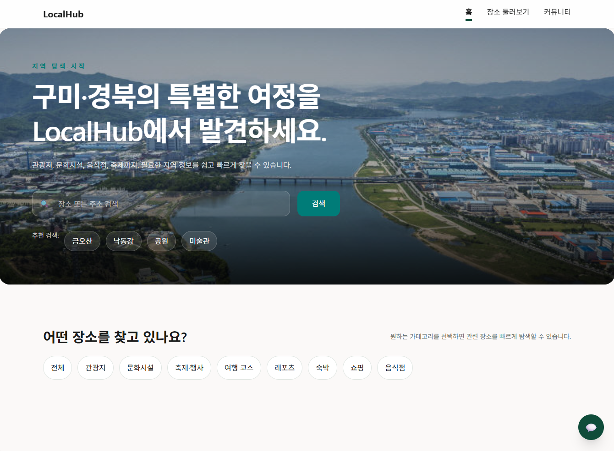
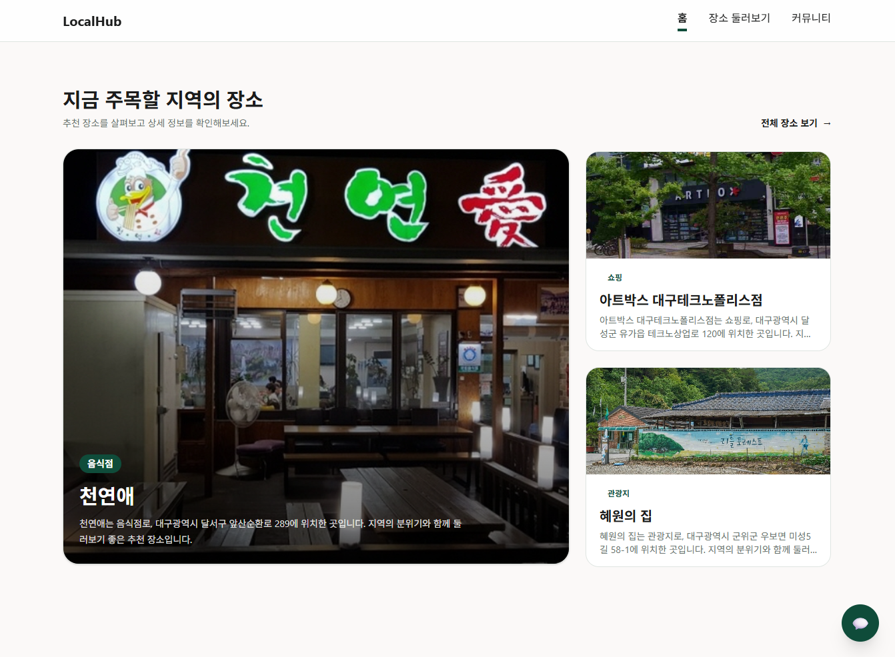
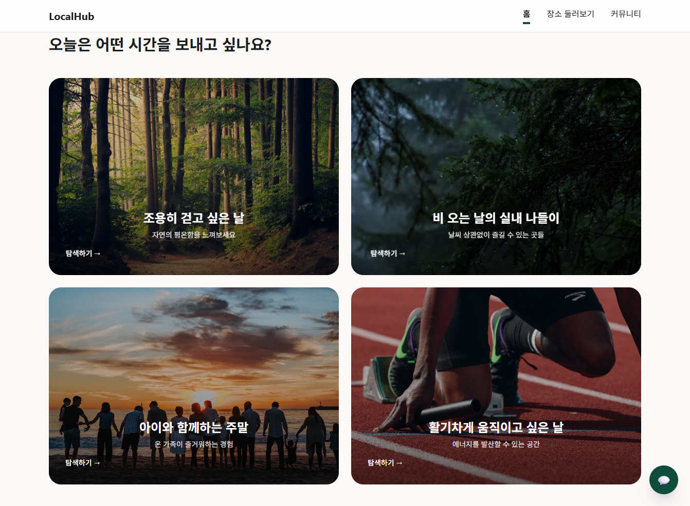
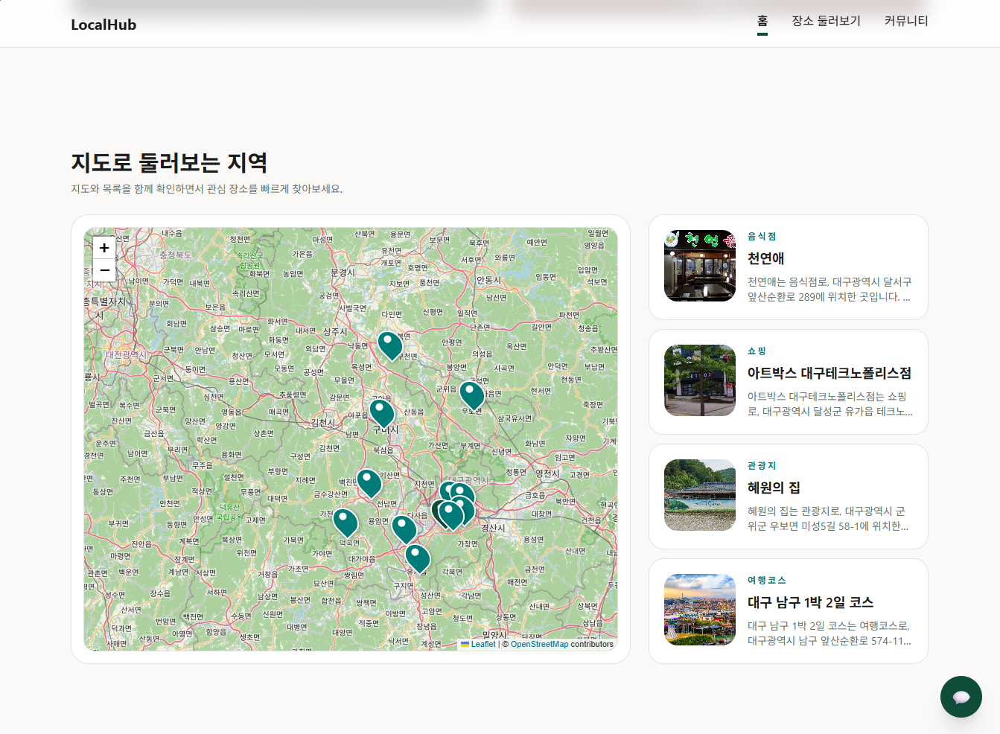
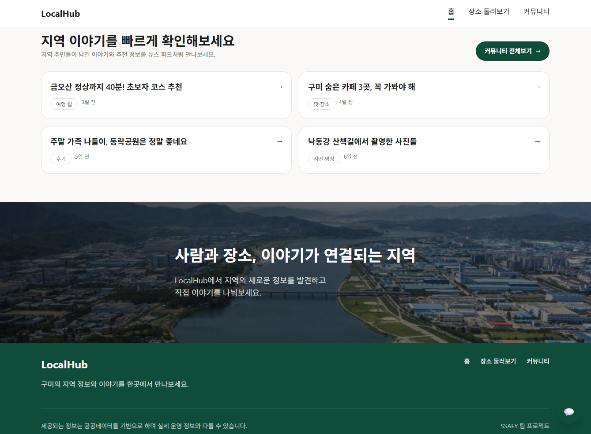
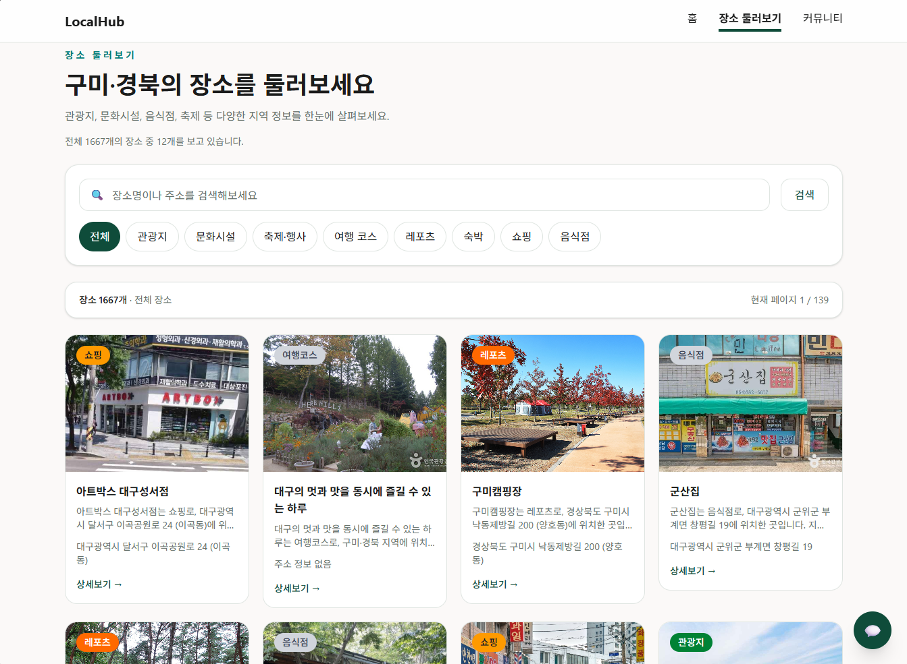
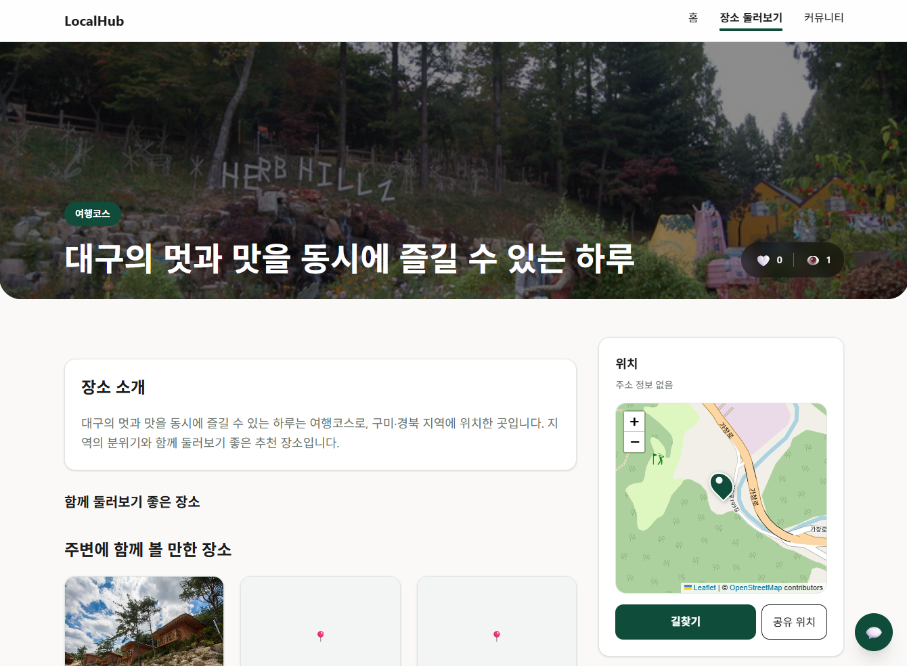
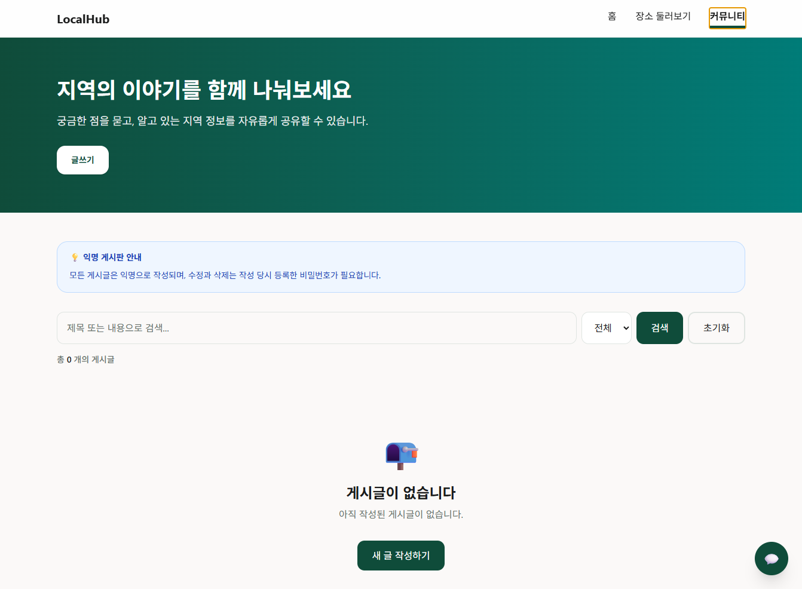
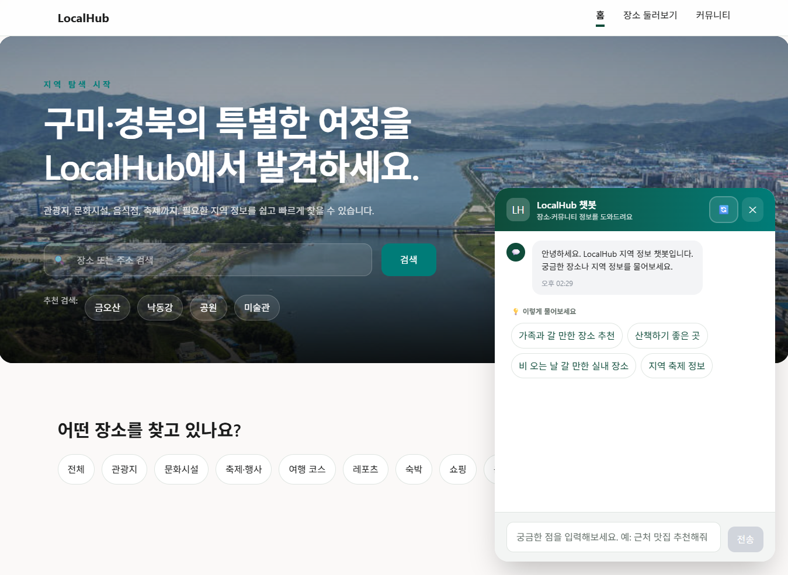
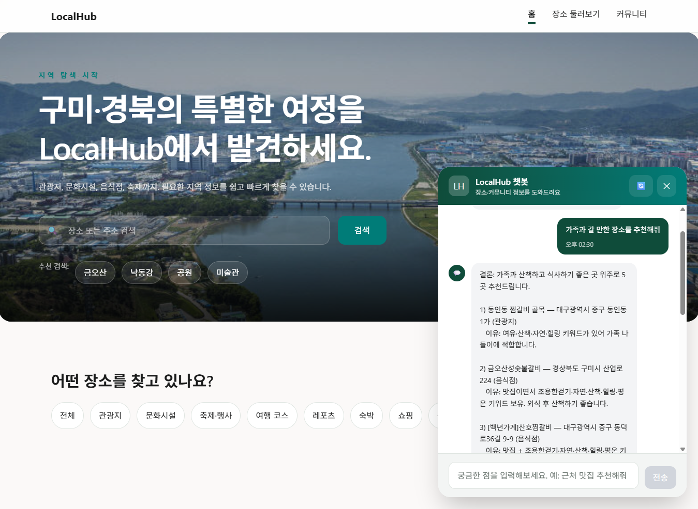

# LocalHub Frontend README

> Vue 3 기반 LocalHub 프론트엔드

## 1. 기술 스택

| 구분 | 기술 |
|---|---|
| Framework | Vue 3 |
| Build Tool | Vite |
| Language | JavaScript |
| Router | Vue Router |
| Styling | Tailwind CSS v4 + CSS Variables |
| Map | Leaflet + OpenStreetMap |
| HTTP Client | Axios |
| Deploy | Netlify 예정 |

---

## 2. 주요 구현 범위

### 홈

- Hero Section
- 카테고리 탐색
- 실제 장소 API 기반 추천 장소
- Leaflet 지도 기반 장소 탐색
- 커뮤니티 미리보기
- 지역 소개 배너

### 장소

- 장소 목록 `/places`
- 검색어와 카테고리 필터
- URL Query 기반 상태 유지
- 페이지네이션
- 장소 상세 `/places/:id`
- 위치 지도
- 주변 장소 추천
- 이미지 fallback
- 좋아요 상태 UI

### 커뮤니티

- 게시글 목록 `/posts`
- 게시글 상세 `/posts/:id`
- 게시글 작성 `/posts/new`
- 게시글 수정 `/posts/:id/edit`
- 비밀번호 확인 모달
- 검색, 카테고리 필터, 페이지네이션

### 챗봇

- 우측 하단 플로팅 버튼
- 열린 대화창 UI
- 추천 질문
- 대화 히스토리
- API 응답 reference 링크
- 모바일 대응

---

## 3. 폴더 구조

```text
src/
├─ api/
│  ├─ http.js
│  ├─ placeApi.js
│  ├─ postApi.js
│  ├─ chatApi.js
│  └─ mappers/
│     ├─ placeMapper.js
│     └─ postMapper.js
├─ assets/
│  └─ main.css
├─ components/
│  ├─ chat/
│  ├─ common/
│  ├─ home/
│  ├─ place/
│  └─ post/
├─ data/
├─ router/
└─ views/
```

---

## 4. 실행 방법

```bash
cd fe
npm install
npm run dev
```

기본 개발 주소:

```text
http://localhost:5173
```

빌드:

```bash
npm run build
```

---

## 5. 환경변수

`.env`:

```env
VITE_API_BASE_URL=http://127.0.0.1:8000
```

주의:

- `.env`는 Git에 포함하지 않습니다.
- 배포 시에는 Netlify 환경변수에 `VITE_API_BASE_URL`을 등록합니다.

---

## 6. API 연동 구조

화면 컴포넌트가 서버 응답을 직접 다루지 않도록 API 함수와 Mapper를 분리했습니다.

```text
View / Component
→ api/*.js
→ api/mappers/*.js
→ FastAPI
```

### 장소 API

- `getPlaces()`
- `getPlace()`
- `getNearbyPlaces()`
- `likePlace()`
- `unlikePlace()`

### 게시글 API

- `getPosts()`
- `getPost()`
- `createPost()`
- `updatePost()`
- `deletePost()`
- `verifyPostPassword()`

### 챗봇 API

- `sendChatMessage()`

---

## 7. 프론트 구현 포인트

- 실제 API 데이터와 Mock 데이터 전환을 고려한 계층 구조
- 장소 목록 URL Query 유지로 새로고침·공유 가능한 검색 상태 구현
- Leaflet 지도 lifecycle 관리 및 마커 선택 상태 연동
- 이미지 없음·좌표 없음·API 오류·빈 결과 상태 처리
- 익명 커뮤니티 수정·삭제 흐름에서 비밀번호 모달과 sessionStorage 검증 흐름 구성
- 챗봇 references를 RouterLink로 연결해 장소 상세 탐색까지 이어지는 흐름 제공

---

## 8. 스크린샷

<table>
  <tr>
    <td></td>
    <td></td>
  </tr>
  <tr>
    <td></td>
    <td></td>
  </tr>
  <tr>
    <td></td>
    <td></td>
  </tr>
  <tr>
    <td></td>
    <td></td>
  </tr>
  <tr>
    <td></td> 
    <td></td> 
  </tr>
</table>
