<div align="center">

# LocalHub

**지역 장소 탐색 · 커뮤니티 · 챗봇을 하나로 연결한 Web Service**

Vue 3 기반으로 장소 탐색, 지도, 익명 커뮤니티와<br/>
추천 챗봇을 구현한 SSAFY 팀 프로젝트입니다.


</div>

---

# Product Experience

<table>
  <tr>
    <td>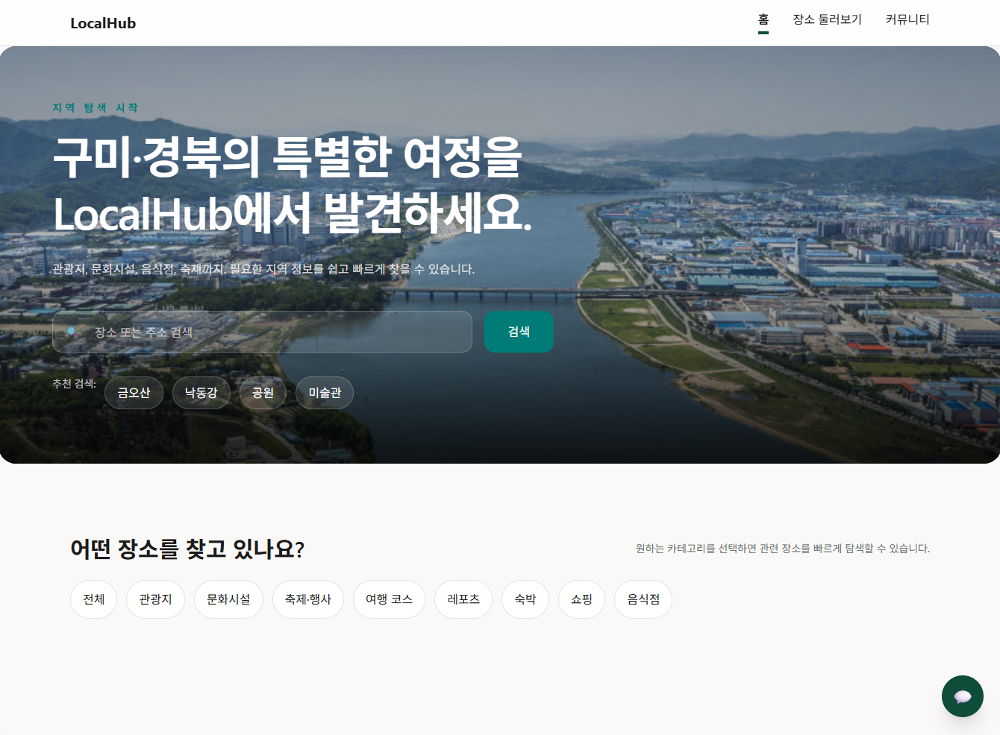</td>
    <td>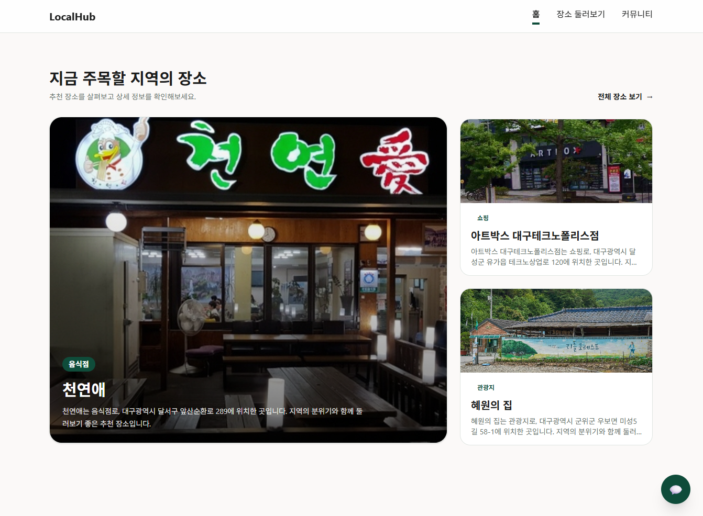</td>
  </tr>
  <tr>
    <td>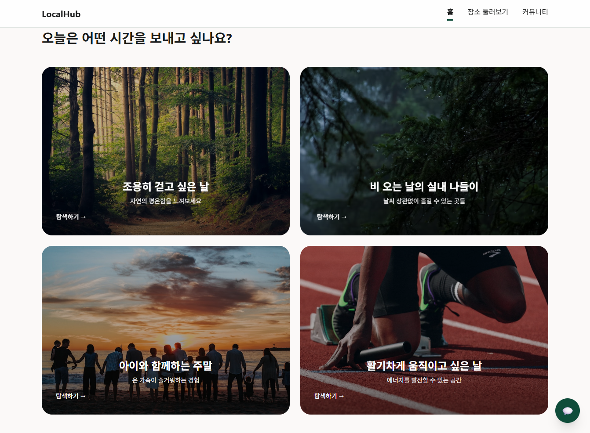</td>
    <td>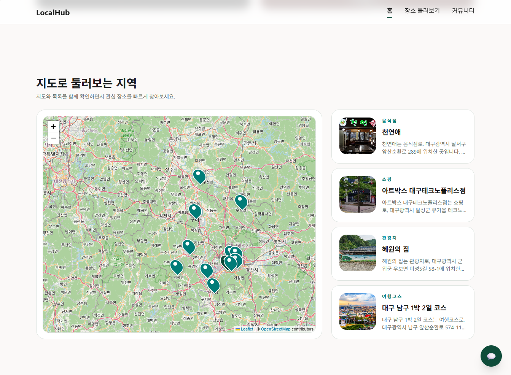</td>
  </tr>
  <tr>
    <td>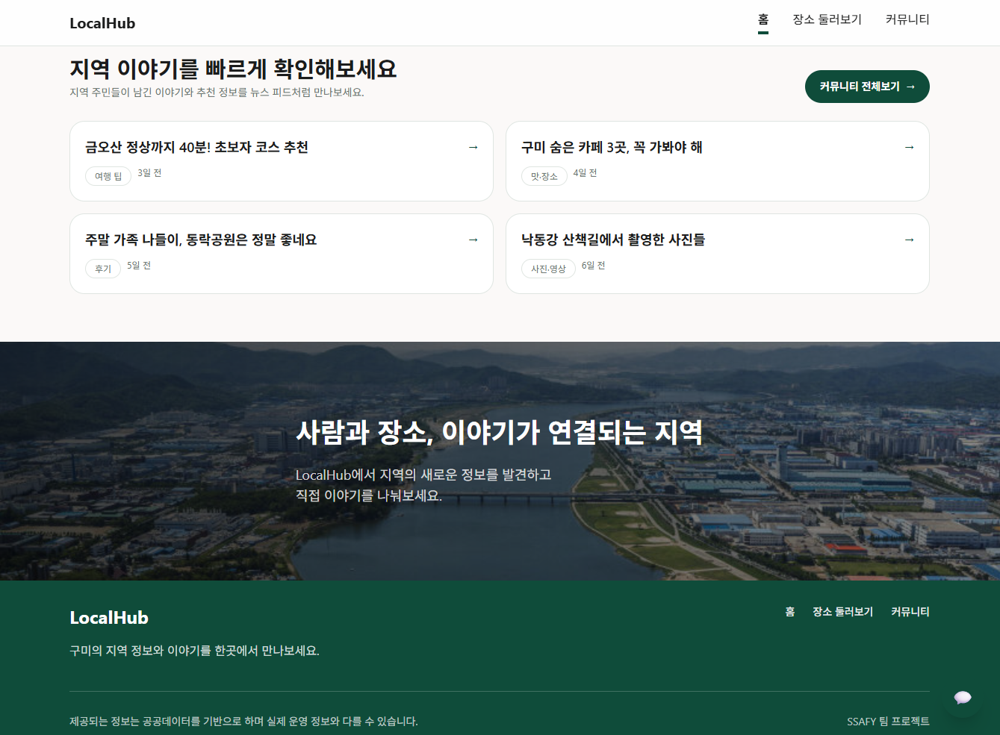</td>
    <td>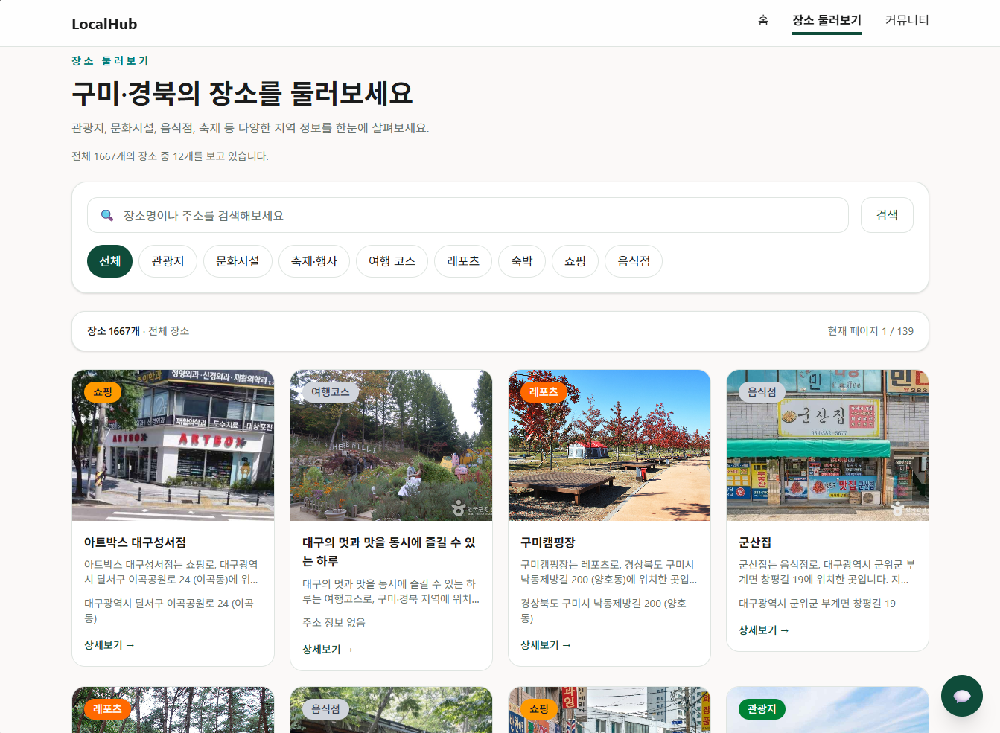</td>
  </tr>
</table>

| Explore | Community | Ask |
| --- | --- | --- |
| 지역의 장소를 지도에서 탐색합니다. | 익명 게시글을 작성하고 공유합니다. | 챗봇을 통해 장소 추천을 확인합니다. |
| Search · Category · Map | CRUD · Password Verification | Chat · References |

---

# Features

## Place

- 장소 검색
- 카테고리 필터
- 페이지네이션
- 장소 상세
- Leaflet 지도
- 주변 장소 추천
- 좋아요

## Community

- 익명 게시글 CRUD
- 검색 / 카테고리
- 비밀번호 확인
- 페이지네이션

## Chat

- Floating Chat Widget
- 대화 History
- 추천 질문
- 장소 Reference
- Reference → 장소 상세 이동

---

# Engineering Highlights

## 01. 검색 상태를 URL에 남기기

장소 목록의 검색어와 Filter를
Component 내부 상태에만 저장하지 않고 URL Query와 연결했습니다.

```text
/places
   ↓
?query=카페&category=FOOD&page=2
```

이를 통해:

```text
Search State
   ↓
URL Query
   ↓
Refresh / Share
   ↓
Same Result State
```

새로고침하거나 URL을 공유하더라도
동일한 탐색 조건을 유지할 수 있습니다.

---

## 02. API Response를 화면이 직접 사용하지 않기

Server의 Response 형태를
Vue Component 전체에 직접 노출하지 않도록 API와 Mapper를 분리했습니다.

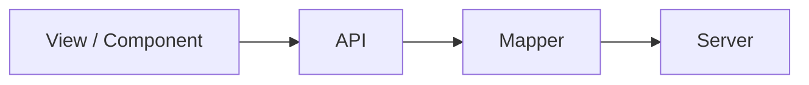
```mermaid
flowchart LR
    A["View / Component"]
    B["API"]
    C["Mapper"]
    D["Server"]

    A --> B --> C --> D
```

```text
src/api/
├── placeApi.js
├── postApi.js
├── chatApi.js
└── mappers/
    ├── placeMapper.js
    └── postMapper.js
```

Server 응답 구조가 변경되더라도
UI 전체가 함께 수정되는 범위를 줄이기 위한 구조입니다.

---

## 03. Leaflet lifecycle을 Vue lifecycle과 맞추기

지도는 일반 DOM 요소보다 별도의 lifecycle을 가집니다.

```text
Vue Mounted
   ↓
Leaflet Map 생성
   ↓
Marker / Props 변경
   ↓
Map Update
   ↓
Vue Unmount
   ↓
Map Cleanup
```

`onMounted`, `watch`, `onBeforeUnmount`를 이용해
Map 생성·업데이트·해제 시점을 Vue lifecycle과 연결했습니다.

---

## 04. 익명 게시글 편집 상태 유지

익명 게시글은 계정 로그인이 없기 때문에
수정·삭제 시 게시글 Password를 확인합니다.

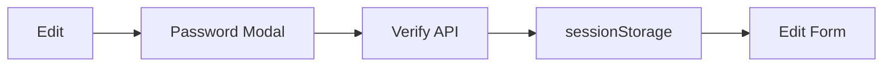
```mermaid
flowchart LR
    A["Edit"]
    B["Password Modal"]
    C["Verify API"]
    D["sessionStorage"]
    E["Edit Form"]

    A --> B --> C --> D --> E
```

같은 페이지 흐름 안에서 이미 인증한 게시글에 대해
불필요하게 Password 확인을 반복하지 않도록
검증 상태를 `sessionStorage`에 보관했습니다.

---

## 05. 챗봇 답변을 다시 실제 장소 탐색으로 연결

챗봇에서 텍스트 답변만 보여주는 것으로 끝내지 않고
응답에 포함된 Reference를 Vue Router와 연결합니다.

```text
Chat Response
     ↓
Reference
     ↓
RouterLink
     ↓
Place Detail
```

사용자는 추천받은 장소를 바로 실제 장소 상세 화면에서 확인할 수 있습니다.

---

# Frontend Structure

```text
src/
├── api/
│   ├── http.js
│   ├── placeApi.js
│   ├── postApi.js
│   ├── chatApi.js
│   └── mappers/
│
├── components/
│   ├── chat/
│   ├── common/
│   ├── home/
│   ├── place/
│   └── post/
│
├── router/
├── views/
└── assets/
```

---

# Tech Stack

| Area | Stack |
| --- | --- |
| Framework | Vue 3 |
| Build | Vite |
| Language | JavaScript |
| Router | Vue Router |
| Style | Tailwind CSS 4 · CSS Variables |
| Map | Leaflet · OpenStreetMap |
| HTTP | Axios |

---

# API

Frontend는 다음 API 영역과 연결됩니다.

```text
Frontend
   ↓
HTTP API
   ├── Place
   ├── Post
   └── Chat
```

이 저장소는 **Frontend 구현을 담고 있으며**,
FastAPI Backend 자체의 소스 저장소는 아닙니다.

---

# Run

```bash
npm install
npm run dev
```

환경변수:

```env
VITE_API_BASE_URL=http://127.0.0.1:8000
```

Production Build:

```bash
npm run build
```

---

# More Screens

<details>
<summary><strong>전체 화면 보기</strong></summary>

<br/>

<table>
  <tr>
    <td>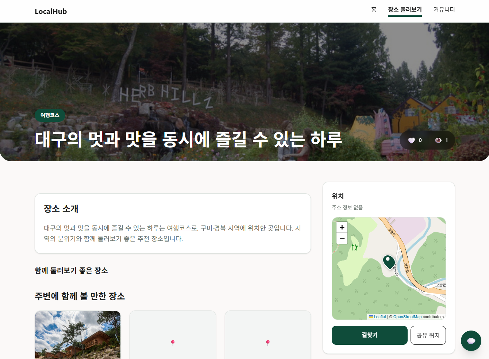</td>
    <td>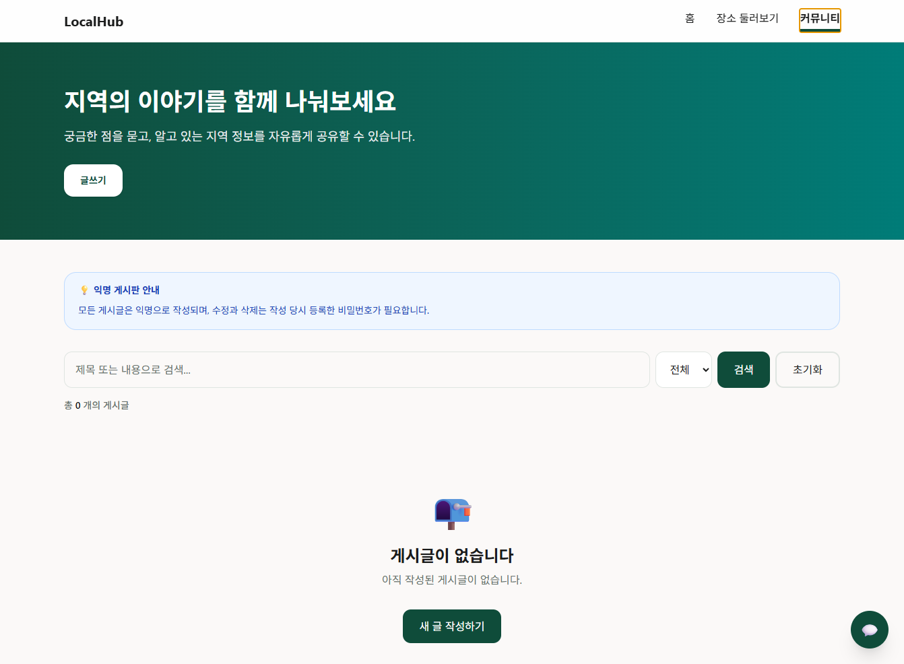</td>
  </tr>
  <tr>
    <td>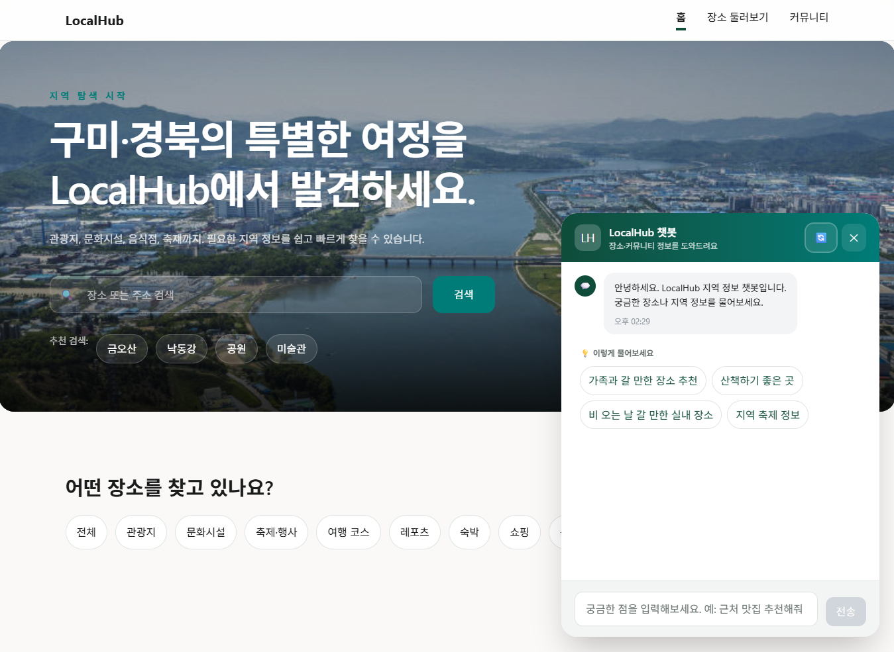</td>
    <td>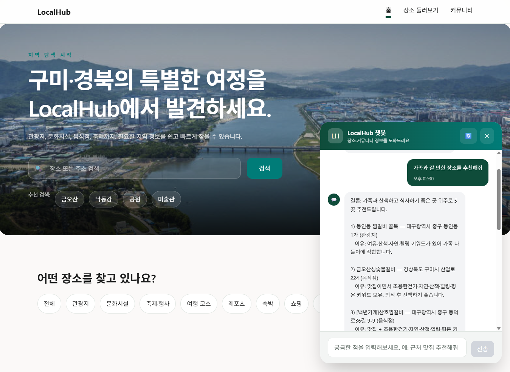</td>
  </tr>
</table>

</details>

---

<div align="center">

**Discover places, share local stories, and ask LocalHub.**

</div>
